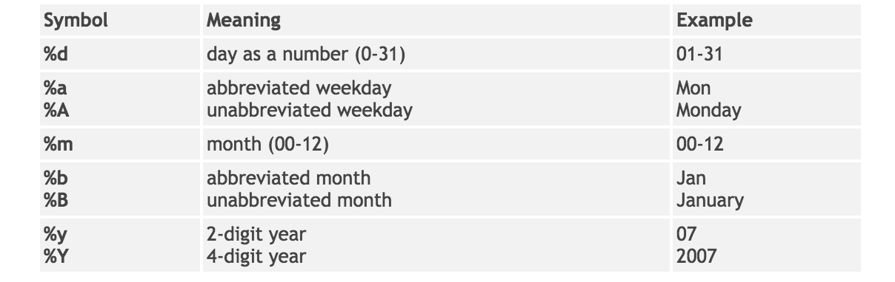

## Convert string to Date: as.Date()

We often needs **Date** data type, e.g. computing difference between 2 dates.


Then function to convert **Date**: ```as.Date(x, format)```

There are many possible date formats for each part of day, month, year

</img>

## Convert string to Date: as.Date()

Example:

```
as.Date("2016-03-18", "%Y-%m-%d") #default, as.Date("2016-03-18")
as.Date("03/18/2016", "%m/%d/%Y")
as.Date("03-18-16", "%m-%d-%y")
as.Date("18Mar2016", "%d%b%Y")
as.Date("18March2016", "%d%B%Y")
```

Get the difference in days
```
as.Date("2016-03-18") - as.Date("2015-03-18")
```

Date can be converted to integer (days since 1970-01-01):

```
as.numeric(as.Date("2016-03-18"))
```

## Computing on Date: lubridate package

**lubridate** package contains lots of fucntions handling dates

```
library(lubridate)
x <- as.Date("2016-05-01")
y <- as.Date("2016-08-10")
year(x)
month(x, label = TRUE)
day(x)
wday(x, label = TRUE)
ceiling_date(y, "month") # first day of next month
y + weeks(4) # 4 weeks later
```

How to find the last day of the month for a date?

## dplyr Package

**dplyr** allows us to perform various essential data tasks as in **sql**:

It implements Split-Apply_Combine strategy <a href="http://vita.had.co.nz/papers/plyr.pdf"> See paper </a>

- **filter()**: filter rows by specified criteria (where in sql)
- **arrange()**: sort data (order by in sql)
- **select()**: select specified columns (select in sql)
- **mutate()**: transform variables based on others (may create new column, select in sql)
- **summarise()**: summarise columns (if by groups then group_by, similar to sql)

## filter()

Get example data
```
library(dplyr)
library(nycflights13)
View(flights)
str(flights)
```

```
filter(flights, month == 1, day == 1)
filter(flights, month == 1 & day == 1)
filter(flights, month == 1 | day == 1)
```

## arange()

```
arrange(flights, year, month, day)
arrange(flights, desc(arr_delay))
```

## select()

```
select(flights, year, month, day)
select(flights, year:day)
select(flights, -(year:day))
rename(flights, tail_num = tailnum)
```

## mutate()

```
mutate(flights,
  gain = arr_delay - dep_delay,
  speed = distance / air_time * 60)
  
mutate(flights,
  gain = arr_delay - dep_delay,
  gain_per_hour = gain / (air_time / 60))
```

We can use mutate_each if same function applied to multiple variables

```
mutate_each(flights, funs(sqrt), air_time, distance)
```

## summarise()

```
summarise(flights,
  delay = mean(dep_delay, na.rm = TRUE))
```

we can summaise by groups

```
summarise(group_by(flights, month),
  delay = mean(dep_delay, na.rm = TRUE))
```

## Chaining

**%>%** can be used to chain multiple steps processing data
```
a1 <- group_by(flights, year, month, day)
a2 <- select(a1, arr_delay, dep_delay)
a3 <- summarise(a2,
  arr = mean(arr_delay, na.rm = TRUE),
  dep = mean(dep_delay, na.rm = TRUE))
a4 <- filter(a3, arr > 30 | dep > 30)
```
can be written as

```
flights %>%
  group_by(year, month, day) %>%
  select(arr_delay, dep_delay) %>%
  summarise(
    arr = mean(arr_delay, na.rm = TRUE),
    dep = mean(dep_delay, na.rm = TRUE)) %>%
  filter(arr > 30 | dep > 30)
```


