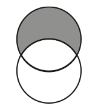
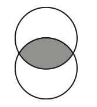

## Vertical Combining: EXCEPT

Similar to **UNION**, **EXCEPT** also combines two tables vertically. It produces rows that are in only the first query result.



- Find countries in **oilprod** table but not in **oilrsrvs** table
```
select country from oilprod
except
select country from oilrsrvs
```

## Vertical Combining: INTERSECT

**INTERSECT** produces rows that belong to both query results



- Find countries in both **oilprod** table and **oilrsrvs** table

```
select country from oilprod
intersect
select country from oilrsrvs
```

## Save Query Results to Table

We can save results returned from a query to a table in the database. We use **CREATE TABLE \<TABLE NAME\> AS**

**Example**: For each continent, find the country with most population and save as a new table call toppopulation

```
create table toppopulation as
select t1.continent, t1.name
  from countries t1 inner join
    (select continent, max(population) as max_population 
    from countries group by continent ) t2
    on t1.continent = t2.continent
  where t1.population = t2.max_population

```

## Create A New Table

We can create new table from scratch with syntax
```
CREATE TABLE table_name
(
column_name1 data_type(size),
column_name2 data_type(size),
column_name3 data_type(size),
....
);
```

Example
```
CREATE TABLE people
(
ID INT,
First CHAR(50),
Last CHAR(50),
Age INT)
```

## Insert/Delete Data
```
INSERT INTO table_name
VALUES (value1,value2,value3,...);
```
```
DELETE FROM table_name
WHERE some_column=some_value;
```

Example
```
INSERT INTO people
VALUEs (1, "John", "Smith", 30), (2, "Joe", "Doe", 60)
```

```
DELETE FROM people
where first = "John"
```

## Delete Table

We can delete a table using **DROP**

Example

```
DROP table people;
```

## SQL Views

- SQL View is a virtual table
- A view contains rows and columns just like real table. The fields in a view are fields from one or more real tables in the database
- The SQL view can be just used as a real table
- A view always shows up-to-date data
- A view is created just like a new table

```
CREATE VIEW view_name AS
SELECT column_name(s)
FROM table_name
WHERE condition
```

## Compare View and Table

First we create two source tables

```
create table one (X INT, Y INT);
insert into one values (1, 2), (2, 3);
create table two (X INT, Y INT);
insert into two values (2, 5), (3, 6), (4, 9)
```

- Create a table joining one and two
```
create table three_table as
select one.*, two.Y as Y2 from one, two where one.X = two.X
```

- Create a view joining one and two
```
create view three_view as
select one.*, two.Y as Y2 from one, two where one.X = two.X
```

## Compare View and Table

three_table and three_view are same.

Now let's make some change to the source tables

```
insert into one values (3, 9)
```

Are three_table and three_view still same?

