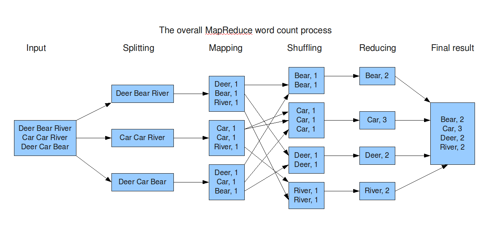

## What is Spark?

- One of the hottest big data tools under rapid development
- Can be 100 times faster than Hadoop for big data processing
- The APIs are very easy to use
- Implements map-reduce
- Suports many languages: R, Python, Java, Scala etc
- Can work with very big data, like PBs

## When Should We Use Spark?

- If data is small (less than a few GB), R package **data.table** and **dplyr** are handy
- If data is too big to fit in memory: e.g. 1TB
    * Spark is very useful especially when we have a computing cluster
    * Data can be stored in distributed file system like Hadoop file system
    * Spark can be used to parallelize data processing task
    * Code we write to work in local can be easily scaled to cluster with minimal modification

## Install Spark

- Install Java JDK (Google 'Java JDK' to downlod and install)
- <a href="http://spark.apache.org/downloads.html">Download Spark</a> from its website. You can choose version 1.6.0, package type 'Pre-built for Hadoop 2.6 and later', and Direct Download
- Unzip the file and save to a location in your disk, for example: **/Users/xgu/spark-1.6.0-bin-hadoop2.6**
- We may also need to install **rJava** R pacakge

## Map Reduce - Word Count

</img>

http://tverbeiren.github.io/BigDataBe-Spark/#

## Map Reduce Example

- The map reduce functions in R are not exported from package
- We should almost never use map reduce in R directly
- SparkR DataFrame should be used as interface to do big data anlysis in R, where map reduce is under the hood to do the actual job
- Example here is only used to illustrate the concept of map-reduce

see sparkR_MapReduce.R

## Use Spark in R - Spark DataFrame

**Download American Community Survey Data**

- Go to https://www.kaggle.com
- Click **Datasets** tab
- Locate **2013 American Community Survey** data to download. You may need to register first.

See sparkR_ACS.R